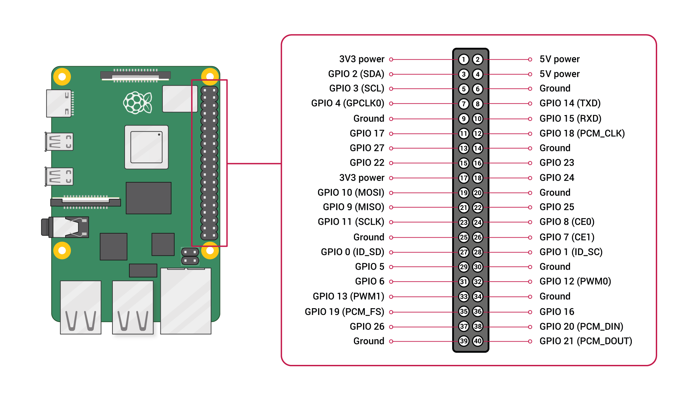

# gpsTime

balena enabled GPS NTP timeserver

## Setup

Get yourself an GPS module that works with this setup, wire it to your RPi and deploy the application with balena.

[](https://dashboard.balena-cloud.com/deploy?repoUrl=https://github.com/nmaas87/gpsTime)

## Variables

There are multiple environmental variables in case you need to customize the setup:

* BAUD: sets the baudrate of your GPS module. Default is 9600, however, if you need e.g. 115200, just set BAUD=115200.
* ALLOW: sets the allow variable within the [NTP server of chrony](https://chrony.tuxfamily.org/doc/3.4/chrony.conf.html). Example: "192.168.178.0/24" as ALLOW will allow only hosts from the network of 192.168.178.0/24 to use the NTP server. If you set ALLOW to "" or "all", it will allow all hosts from anywhere.
* OFFSET: sets the [OFFSET value for GPS within chrony](https://chrony.tuxfamily.org/doc/3.4/chrony.conf.html). Default is 0.0 - and an empty ("") or default value ("0.0") will mean that no offset will be applied.

## Which GPS module to use

All 3v3 TTL-LvL GPS modules with PPS output should be working, it was tested with [Watterott's CAM-M8Q-Breakout Multi GNSS Modul (GPS, QZSS, GLONASS, BeiDou, Galileo)](https://shop.watterott.com/CAM-M8Q-Breakout-Multi-GNSS-Modul-GPS-QZSS-GLONASS-BeiDou-Galileo), but should also work with e.g. [Adafruit Ultimate GPS Breakout - 66 channel w/10 Hz updates - Version 3](https://www.adafruit.com/product/746).

## Wiring

* GPS 3v3 -> RPi 3v3 power
* GPS GNS -> RPi Ground
* GPS TX -> RPi GPIO 15 (RXD)
* GPS RX -> RPi GPIO 14 (TXD)
* GPS PPS -> RPi GPIO 18 (PCM_CLK)



Pinout taken from official [Raspberry Pi Documentation](https://www.raspberrypi.org/documentation/usage/gpio/). Please bear in mind this wiring schematic is correct for RPi 1A+/B+ and following.

## Debugging

You can use the balenaCloud Terminal to directly connect to the gpsTime console. There you can use:

* ````chronyc sources -v````

to see the currently used device (should be like shown below, * PSM0 means PSM0 is used, which is the correct device)
````
.-- Source mode  '^' = server, '=' = peer, '#' = local clock.
 / .- Source state '*' = current best, '+' = combined, '-' = not combined,
| /             'x' = may be in error, '~' = too variable, '?' = unusable.
||                                                 .- xxxx [ yyyy ] +/- zzzz
||      Reachability register (octal) -.           |  xxxx = adjusted offset,
||      Log2(Polling interval) --.      |          |  yyyy = measured offset,
||                                \     |          |  zzzz = estimated error.
||                                 |    |           \
MS Name/IP address         Stratum Poll Reach LastRx Last sample               
===============================================================================
#? PPS0                          0   3   377     9   +899ns[ +907ns] +/- 1176ns
#? GPS0                          0   3   377    10   +104ms[ +104ms] +/-  100ms
#* PSM0                          0   3   377     9   +899ns[ +907ns] +/- 1176ns
#? PST0                          0   3   377     9   +899ns[ +899ns] +/- 1176ns 
````

* ````gpsmon -n````

to provide you a look about all incoming GPS data

````
┌──────────────────────────────────────────────────────────────────────────────┐
│
└───────────────────────────────── Cooked TPV ─────────────────────────────────┘
┌──────────────────────────────────────────────────────────────────────────────┐
│ GPZDA GPGGA GPRMC GPGSA GPGBS GPGSV                                          │
└───────────────────────────────── Sentences ──────────────────────────────────┘
┌──────────────────┐┌────────────────────────────┐┌────────────────────────────┐
│PRN  Az El S/N    ││Time:      183727.00        ││Time:      183727.00        │
│  1 000  2  10    ││Latitude:     0.0 N         ││Latitude:  0.0              │
│  2 000 26  22    ││Longitude:   0.0 W          ││Longitude: 0.0              │
│  3 000 35  10    ││Speed:     0.4918           ││Altitude:  0.0              │
│  4  00 69   9    ││Course:    0.0              ││Quality:   1   Sats: 07     │
│  6 000 55  21    ││Status:    A       FAA:     ││HDOP:      2.04             │
│  7 000 16  27    ││MagVar:    2.2  E           ││Geoid:     46.18            │
│  9 000 70  25    │└─────────── RMC ────────────┘└─────────── GGA ────────────┘
│ 11 000 28  16    │┌────────────────────────────┐┌────────────────────────────┐
│ 17 000  8  26    ││Mode: A3 Sats: 4 7 9 17 19  ││UTC:           RMS:         │
│ 19 000 20  24    ││DOP: H=2.0   V=2.2   P=3.0  ││MAJ:           MIN:         │
│ 22 000 13   0    ││TOFF:  0.102425538          ││ORI:           LAT:         │
│ 26  00  6   0    ││PPS: -0.000001842           ││LON:           ALT:         │
└────── GSV ───────┘└──────── GSA + PPS ─────────┘└─────────── GST ────────────┘
------------------- PPS offset:  0.000000003 ------
````

* ````chronyc makestep````

To make chrony "tick" the local clock on the RPi to the next time in a hard sweep, not via soft modification over time.

## Optimization

* Disable all GPS messages on your GPS receiver except $GPRMC or $GPZDA - both of these contain time & date. With this, less data is needed to transfer and gpsd can work better.
* Increase data transfer on your GPS receiver from 9600 to 115200 BAUD. Then you also need to configure the BAUD in balenaCloud (see above under Variables).


## Thanks

A lot of this is taken from the excellent work of beta-tester's Repo, but also other websites. To give an overview to all these awesome people:

* https://github.com/beta-tester/RPi-GPS-PPS-StratumOne
* https://github.com/patricktokeeffe/rpi-ntp-server
* https://www.tomvoboril.com/2021/06/gps-and-raspberry-pi-stratum-1-server.html
* https://github.com/misterpeee/balena-gps-ntpsecd
